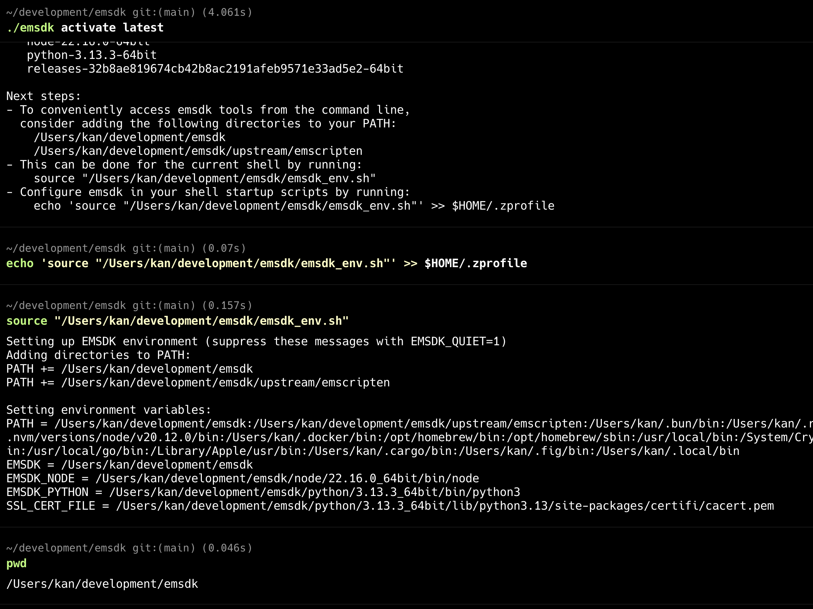
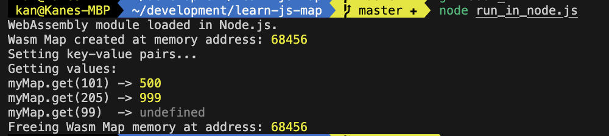

# C Map in JavaScript via WebAssembly

This project is a low-level demonstration of how to implement a hash map data structure in C, compile it to WebAssembly (Wasm), and use it within a JavaScript application (both in the browser and Node.js).

It serves as a practical guide for bridging high-performance C code with the JavaScript ecosystem.

## How It Works

The core logic for the hash map is written in C (cmap.c) for performance and manual memory management. This C code is then compiled using the Emscripten SDK into a .wasm binary file and a JavaScript "glue" file (cmap.js).

The JavaScript application loads the Wasm module and calls the exported C functions (map_create, map_set, etc.) to perform map operations. A simple JavaScript wrapper class (WasmMap) is used to provide a clean, high-level API.

## Prerequisites

Before you begin, ensure you have the following installed:

Node.js: Used for running the local web server and the Node.js example.

Emscripten SDK: The compiler toolchain to convert C/C++ to WebAssembly. (See official installation guide).

### Install emsdk

Link: https://emscripten.org/docs/getting_started/downloads.html

```
git clone https://github.com/emscripten-core/emsdk.git
cd emsdk/

./emsdk install latest
./emsdk activate latest

echo 'source "/Users/kan/development/emsdk/emsdk_env.sh"' >> $HOME/.zprofile
source "/Users/kan/development/emsdk/emsdk_env.sh"
```



## Other Vscode extensions

- C/C++
- C/C++ Extension Pack
- Code Runner

## Compile C to WebAssembly

```
cd learn-js-map/cmap

emcc cmap.c -o cmap.js -s EXPORTED_RUNTIME_METHODS=ccall,cwrap
```

## Run in Node.js

```
cd learn-js-map

node run_in_node.js
```



## VS Code IntelliSense Configuration (Optional)

If you see an error in VS Code like cannot open source file "emscripten.h", it means the editor's IntelliSense engine doesn't know where to find the Emscripten header files.

Create a file at .vscode/c_cpp_properties.json.

Add the path to your Emscripten SDK's system headers in the includePath. Make sure to add /\*\* at the end to allow recursive searching.

```
{
    "configurations": [
        {
            "name": "Emscripten",
            "includePath": [
                "${workspaceFolder}/**",
                // Replace with the actual path to your emsdk installation
                "/path/to/your/emsdk/upstream/emscripten/**"
            ],
            "cStandard": "c17"
        }
    ],
    "version": 4
}
```

Restart VS Code for the changes to take effect.
